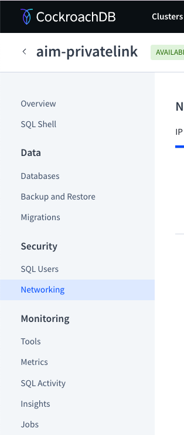

# Private Link Demo

## Step 1

Create a Cockroach Cloud Advanced or Standard Cluster

- Navigate to the **Networking** page.



- Select the **Private endpoint** tab.
- Click **Add a private endpoint** in the connection dialog.

NOTE: Preparing endpoint services, this may take a few minutes...

## Step 2

Execute the `dply_aws_infra.yml` ansible playbook

```
time ansible-playbook dply_aws_infra.yml

...

ansible-playbook dply_aws_infra.yml -vvv  3.59s user 1.92s system 19% cpu 28.962 total
```

**NOTE** In the AWS Console, validate all the infrastructure components were created.

## Step 3

Save the Public IP of the ec2 instance in the `inventory.ini` file
```
privateLink % aws ec2 describe-instances\
        --filters 'Name=tag:Name,Values=aim-pl-cc-dedicated'\
                  'Name=instance-state-name,Values=running'\
        --output text\
        --query 'Reservations[].Instances[].[PublicIpAddress]'\
        --profile 337380398238_CRLRevenue\
        --region us-west-2 > inventory.ini
```

## Step 4

Configure and deploy CRDB 

```
time ansible-playbook --private-key aim-pl-key.pem -i inventory.ini crdb_setup.yml --skip-tags "install_devtools"
```

Enter **yes** to add the nodes to the known hosts file

```
Are you sure you want to continue connecting (yes/no/[fingerprint])? yes
```

It takes roughly 7.70s user 8.11s system 4% cpu 6:02.75 total

## Step 5

Validate the Private Link endpoint

- Make sure the service name is the same that the one in the **vars.yml** file
- validate the endpoint
```
Your endpoint has been accepted. Once your endpoint status changes to Available in the AWS console, you will be able to connect.
```

```
ansible-playbook --private-key aim-pl-key.pem -i inventory.ini crdb_setup.yml  7.21s user 8.71s system 4% cpu 6:12.33 total
```

## Step 6

Enable private DNS

- On the Amazon VPC Console Endpoints page, select the endpoint you created.
- Click Actions.
- Click Modify Private DNS Names.
- Check the Enable Private DNS Name checkbox.
- Click Modify Private DNS Name.
- In the CockroachDB Cloud Console, click Complete to save the configuration and close the dialog.

Test private link connection

- login to the ec2 instance as roachie/roachfan
- Download the certificate

```
$ curl --create-dirs -o $HOME/Library/CockroachCloud/certs/1d4d68ed-a173-461e-a522-4fbca2b062e1/aim-privatelink-ca.crt 'https://cockroachlabs.cloud/clusters/e007b311-4d97-450b-af94-8c2edb3cc1cb/cert'
```

- Connect to your database.

```
$ cockroach sql --url "postgresql://roachie@internal-aim-privatelink-rk2.aws-us-west-2.cockroachlabs.cloud:26257/defaultdb?sslmode=verify-full&sslrootcert=$HOME/Library/CockroachCloud/certs/1d4d68ed-a173-461e-a522-4fbca2b062e1/aim-privatelink-ca.crt"
#
# Welcome to the CockroachDB SQL shell.
# All statements must be terminated by a semicolon.
# To exit, type: \q.
#
Connecting to server "internal-aim-privatelink-rk2.aws-us-west-2.cockroachlabs.cloud:26257" as user "roachie".
Enter password:
# Client version: CockroachDB CCL v24.2.3 (x86_64-pc-linux-gnu, built 2024/09/23 22:30:53, go1.22.5 X:nocoverageredesign)
# Server version: CockroachDB CCL v24.3.2 (x86_64-pc-linux-gnu, built 2024/12/25 02:01:19, go1.22.8 X:nocoverageredesign)
# Cluster ID: d5673e14-0d8e-4453-b2fd-05786be3a859
# Organization: Cockroach Cloud - crl-prod-rk2
#
# Enter \? for a brief introduction.
#
